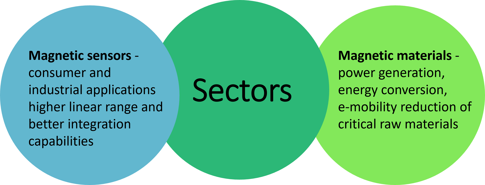

.. MaMMoS documentation master file, created by
   sphinx-quickstart on Mon Oct  2 09:55:58 2023.
   You can adapt this file completely to your liking, but it should at least
   contain the root `toctree` directive.

**Ma**\gnetic **M**\ultiscale **Mo**\delling **S**\uite
=======================================================

.. toctree::
   :hidden:
   :maxdepth: 1

   Home <self>
   objectives
   who-we-are
   events
   units
   resources
   open-positions
   related-eu-projects

What is MaMMoS about?
---------------------

Magnetic materials are essential for many applications in energy, information, and communication technologies.
However, the complex phenomena at different length and time scales often limit the development of new magnetic
materials and devices. The goal of this project is to develop a magnetic multiscale modeling suite that will
allow the design and optimisation of magnetic materials and devices based on multiscale modelling,
characterisation, and numerical optimisation.

MaMMoS Framework Software
-------------------------

The MaMMoS framework provides software components for magnetic multiscale
modeling.

The `MaMMoS demonstrator
<https://mammos-project.github.io/mammos/demonstrator/>`__ contains end-to-end
workflows combining functionality of multiple of the MaMMoS framework
components. Each workflow is provided as a Jupyter notebook, which can be
browsed as static HTML on the demonstrator webpages, executed in the cloud, or
downloaded for local execution with more powerful hardware. Further details can
be found on the demonstrator page.

The following table provides a short overview of the individual framework
components and contains links to the individual repositories and the
documentation:

.. list-table::
   :header-rows: 1

   * - Package repository
     - Summary
   * - `mammos <https://github.com/mammos-project/mammos>`__
       (`documentation <https://mammos-project.github.io/mammos>`__)
     - Meta package to install the full MaMMoS simulation suite.
   * - `mammos-analysis <https://github.com/mammos-project/mammos-analysis>`__
       (`documentation <https://mammos-project.github.io/mammos>`__)
     -  Post-processing (hysteresis loop, kuzmin, ...).
   * - `mammos-dft <https://github.com/mammos-project/mammos-dft>`__
       (`documentation <https://mammos-project.github.io/mammos>`__)
     - DFT-based magnetic material properties.
   * - `mammos-entity <https://github.com/mammos-project/mammos-entity>`__
       (`documentation <https://mammos-project.github.io/mammos>`__)
     - Entity (Quantity and EMMO ontology label).
   * - `mammos-mumag <https://github.com/mammos-project/mammos-mumag>`__
       (`documentation <https://mammos-project.github.io/mammos>`__)
     - Finite-element micromagnetic simulations (hysteresis).
   * - `mammos-spindynamics <https://github.com/mammos-project/mammos-spindynamics>`__
       (`documentation <https://mammos-project.github.io/mammos>`__)
     - Spindynamics-based magnetic material properties.
   * - `mammos-units <https://github.com/mammos-project/mammos-units>`__
       (`documentation <https://mammos-project.github.io/mammos>`__)
     - Quantities (values with units).

Additional Tools
----------------

The following tools have been created through or supported by the MaMMoS
project. For each, please follow the link for installation instructions and
documentation:

.. list-table::
   :header-rows: 1

   * - Package repository
     - Summary
   * - `mochada_kit <https://github.com/MaMMoS-project/mochada_kit>`__
       (`documentation <https://mammos-project.github.io/mochada_kit/user/index.html>`__)
     - Workflow diagram builder
   * - `sem_io <https://github.com/MaMMoS-project/sem_io>`__
       (`documentation <https://github.com/MaMMoS-project/sem_io/blob/main/README.md>`__)
     - Metadata extraction from SEM images
   * - `DaHU <https://github.com/MaMMoS-project/DaHU>`__
       (`documentation <https://github.com/MaMMoS-project/DaHU/blob/main/README.md>`__)
     - Data analysis dashboard for specific instruments at Institut Néel
   * - `Read_HDF5 <https://github.com/MaMMoS-project/Read_HDF5>`__
       (`documentation <https://github.com/MaMMoS-project/Read_HDF5/blob/main/readme.md>`__)
     - Data tools to read and write HDF5 files at Institute Néel
   * - `nomad <https://github.com/MaMMoS-project/nomad>`__
       (`documentation <https://github.com/MaMMoS-project/nomad/blob/main/README.md>`__)
     - Tools for uploading data to Nomad
   * - `magmeas <https://github.com/MaMMoS-project/magmeas>`__
       (`documentation <https://github.com/MaMMoS-project/magmeas/blob/main/README.md>`__)
     - Python package to import magnetometry data and calculate extrinsic magnetic properties

Current vacancies
-----------------

One upcoming `open position at MPSD in Hamburg <open-positions.html>`__ (September 2025).

Further information
-------------------

:email:`thomas.schrefl@donau-uni.ac.at`

Project: 101135546 — MaMMoS

`HORIZON-CL4-2023-DIGITAL-EMERGING-01 <https://ec.europa.eu/info/funding-tenders/opportunities/portal/screen/opportunities/topic-details/horizon-cl4-2023-digital-emerging-01-12;callCode=null;freeTextSearchKeyword=2023-DIGITAL-EMERGING-01;matchWholeText=true;typeCodes=1>`_

Disclaimer
----------

Funded by the European Union. Views and opinions expressed are however those of the author(s) only and do not
necessarily reflect those of the European Union or European Health and Digital Executive Agency (HADEA). Neither
the European Union nor the granting authority can be held responsible for them.

Acknowledgments
---------------

.. figure:: _static/zulip-icon-128x128.png
   :align: left
   :scale: 50%
   :target: https://zulip.com/

Project MaMMoS is sponsored by `Zulip <https://zulip.com>`__. `Zulip <https://zulip.com>`__ is an organised team chat app designed for efficient communication, and used for project communication and software development within MaMMoS.
